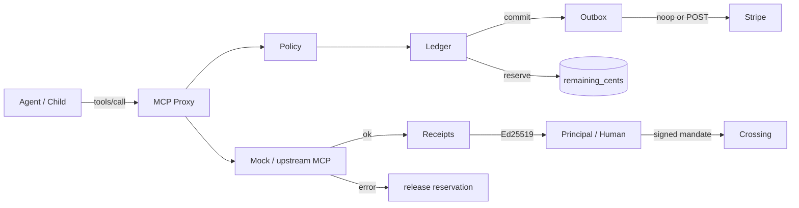

# The Crossing

Agent Economic Runtime. Humans issue **signed spend mandates**. Agents and sub-agents may only spend what those mandates allow. Every `tools/call` is quoted, authorized, reserved, executed, then committed or released. Receipts are Ed25519-signed. Stripe is an outbox adapter, not the source of truth.

Default store is SQLite (`DATABASE_URL=sqlite:///./crossing.db`). Postgres is optional via `docker compose --profile postgres up`.

## Quick start

```bash
export CROSSING_ALLOW_DEV=1
pip install -r requirements.txt
PYTHONPATH=. python -m pytest tests -q
PYTHONPATH=. python -m crossing.demo
uvicorn crossing.api:app --reload
```

Production refuses a missing `CROSSING_ED25519_SEED` (64 hex chars) unless `CROSSING_ALLOW_DEV=1`.

## Architecture



Lifecycle: **quote → authorize → reserve → execute → commit | release**.

Child mandates are *attenuated*: spend, max_call, tools/servers subset, expiry not later than parent, `max_subagent_budget <= remaining`. Issuing a child **escrows** the child's spend cap from the parent remaining budget.

## Threat model

In scope (enforced in-process):

| Threat | Control |
| --- | --- |
| Forged mandate | Ed25519 over canonical mandate payload |
| Tampered receipt | Ed25519 over canonical receipt body |
| Overspend / TOCTOU | `BEGIN IMMEDIATE` + remaining_cents decrement in the same transaction |
| Child privilege escalation | Attenuation checks before insert |
| Replay | `used_nonces` unique per principal; mandate nonce unique |
| Duplicate charge | `idempotency_key` unique per principal |
| Revoked operator | Agent + descendant revoke |
| Billing side effects | Outbox: Stripe failure cannot roll back a committed ledger row |
| Tool blast radius | Mandate tools/servers allow-lists; purchase ($5) denied when only search is granted |

Out of scope for this MVP:

- Multi-host consensus / serializable isolation across Postgres replicas
- Hardware key custody (seed is an env var)
- Network-level MCP attestation of upstream servers
- Real user authn on the HTTP API (bind it behind your gateway)
- Legal enforceability of a mandate in any jurisdiction

## HTTP

- `GET /health`
- `GET /` dashboard (plain HTML tables)
- `POST/GET /v1/principals`
- `POST/GET /v1/agents` and `POST /v1/agents/{id}/revoke`
- `POST /v1/mandates` `GET /v1/mandates/{id}`
- `POST /v1/invoke`
- `GET /v1/receipts` `GET /v1/receipts/{id}`

## SDK

```python
from crossing.sdk import Crossing
cx = Crossing.in_process()
p = cx.create_principal("Alice")
a = cx.create_agent(p.id, "researcher")
m = cx.issue_mandate(p.id, a.id, 100, tools=["search"], servers=["mock"])
print(cx.quote("search"))  # 5 cents
r = cx.invoke(m.id, "search", {"q": "hi"}, idempotency_key="k1")
assert r.ok and cx.verify_receipt(r.receipt)
```

## Pricing (mock MCP)

| Tool | Price |
| --- | --- |
| `search` | $0.05 |
| `purchase` / `expensive` | $5.00 |

Stripe: if `STRIPE_SECRET_KEY` is unset the adapter no-ops **and still writes an outbox row** (`status=noop`). Failures mark `failed` and never undo `commit`.
